# 1. Creando imágenes
## Paso 1
Ejecuta un contenedor basado en la imagen:

**`ubuntu`**

Con el comando

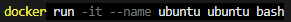

Se arranca el contenedor y se accede directamente a la terminal del mismo:

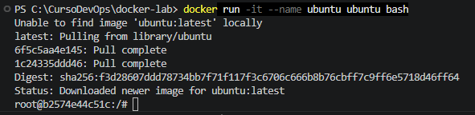

Una vez dentro de la terminal, ejecutamos el siguiente comando para actualizar el sistema e instalar **`curl`**:

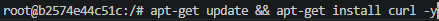

Con el comando **`curl --version`** comprobamos que se ha instalado correctamente:

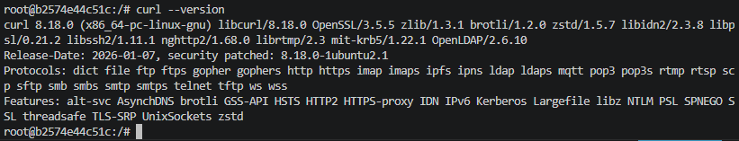

## Pregunta
¿Con qué comando podrías **guardar los cambios del contenedor como una nueva imagen**?

Con el comando **`docker commit`**

Si miramos la ayuda de **docker** obtenemos la siguiente información:

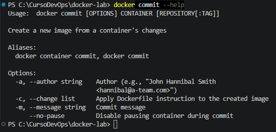

Donde:
- **`CONTAINER`** sería el contenedor.
- **`REPOSITORY`** sería el nombre que daríamos a la imagen.
- **`[:TAG]`** sería la versión o etiqueta que asignaríamos a la imagen.

## Paso 2
Crea un **`Dockerfile`** que haga lo mismo automáticamente.

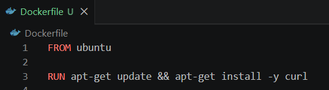

Construye la imagen y ejecuta un contenedor.

- Con el comando **`docker build -t ubuntu-paso-2 .`** se construye la imagen:

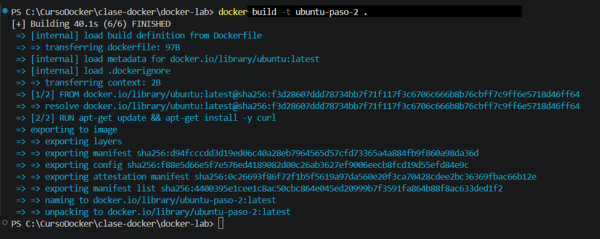

- Con el comando **`docker run -it ubuntu-paso-2`** se ejecuta el contenedor:

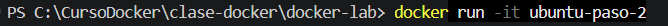

Y, una vez dentro del contenedor, podemos comprobar si se ha instalado **`curl`** con el comando **`curl --version`**:

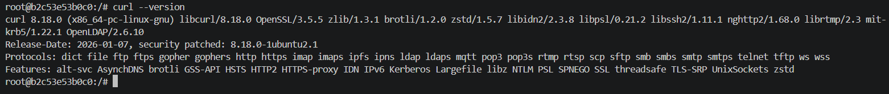

## Pregunta
¿Qué comando permite ver las **capas de una imagen Docker**?

El comando **`docker history <imagen>`**

Por ejemplo:

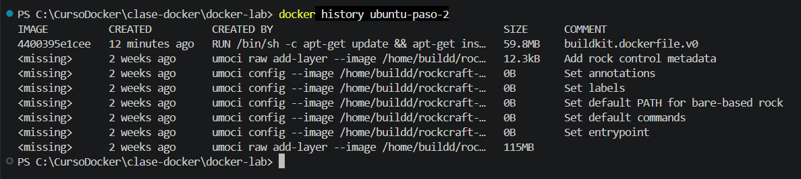

# 2. Limpiando imágenes (opcional)
Crea un **`Dockerfile`** basado en:

**`ubuntu`**

Para este ejercicio he creado el siguiente **`Dockerfile`** llamado **`Dockerfile.ejercicio-2-ubuntu`**:

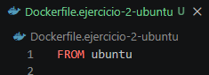

Para crear la imagen, ejecuto el siguiente comando:

**` docker build -f ./Dockerfile.ejercicio-2-ubuntu -t ubuntu-ejercicio-2 .`**

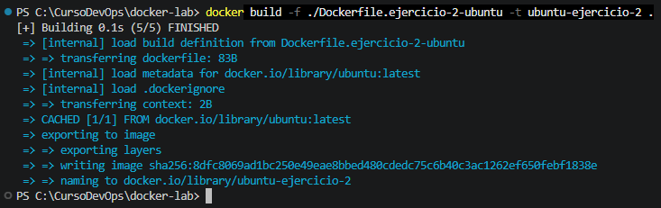

Se debe modificar el **`Dockerfile`** para instalar **`curl`**:

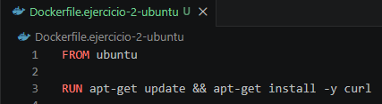

Para crear la imagen, ejecuto el mismo comando de antes:

**` docker build -f ./Dockerfile.ejercicio-2-ubuntu -t ubuntu-ejercicio-2 .`**

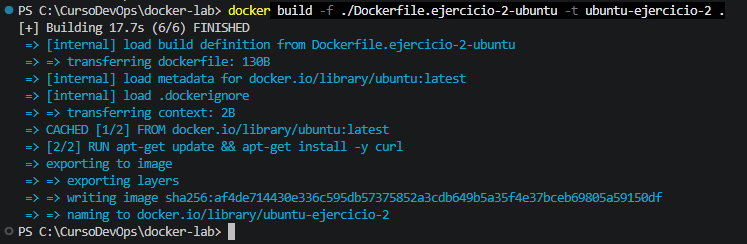

Se debe volver a modificar el **`Dockerfile`** para instalar **`wget`**:

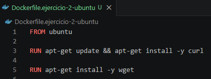

Para crear la imagen, volvemos a ejecutar una vez más el mismo comando:

**` docker build -f ./Dockerfile.ejercicio-2-ubuntu -t ubuntu-ejercicio-2 .`**

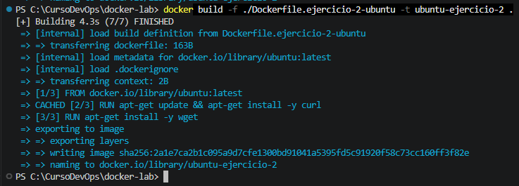

Vamos a listar las imágenes con el comando **`docker images`**:

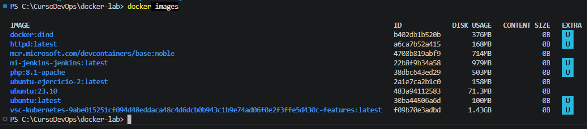

## Pregunta
¿Qué ocurre con las imágenes anteriores?

Como no se ha cambiado el nombre de la imagen ni se ha añadido ninguna etiqueta, se ha creado una sola imagen (en vez de tres imágenes diferentes) añadiendo las capas necesarias sobre las capas de las imágenes anteriores para crear la nueva imagen.

# 3. Volúmenes persistentes
Ejecuta un contendor de:

**`postgres`**

Usa un volumen **`Docker`** montado en:

**`/var/lib/postgresql/data`**

A partir de la versión 18 de postgres se recomienda montar el volumen en **`/var/lib/postgresql`**, por tanto, se ejecuta el comando:

**`docker run -d --name postgres-ejercicio-3 -e POSTGRES_PASSWORD=ardilla --mount source=postgres-data,target=/var/lib/postgresql postgres`**

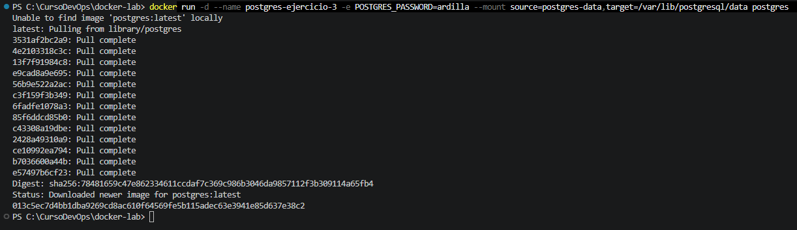

Señalar que para crear el contenedo, es necesario la variable de entorno **`POSTGRES_PASSWORD`** para establecer la contraseña del superusuario **`postgres`**.

Podemos ver cómo se ha creado el contenedor y está en ejecución:

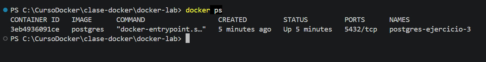

## Crear tabla

- Conéctate a la base de datos:
Para conectarnos a la base de datos ejecutamos el siguiente comando:

**`docker exec -it postgres-ejercicio-3 psql -U postgres`**

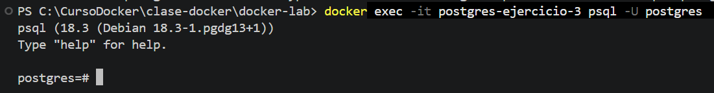

- Crea la tabla:
Una vez que ya estamos dentro, lanzamos directamente la sentencia para crear la tabla:

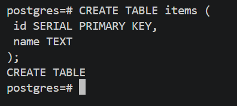

- Inserta un registro:
Hacemos lo mismo que para la creación de la tabla:

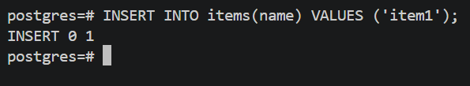

Comprobamos que la tabla se ha creado y el registro se ha insertado correctamente:

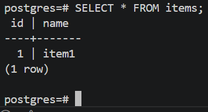

## Comprobación

1. Para el contenedor
2. Elimina el contenedor
3. Crea un nuevo contenedor usando **el mismo volumen**

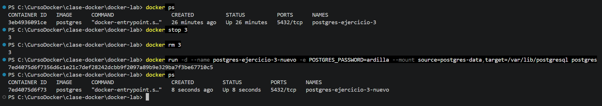

- Comprueba que los datos siguen existiendo.

En primer lugar accedo al contenedor y, una vez dentro, ejecuto la sentencia:

**`SELECT * FROM items;`**

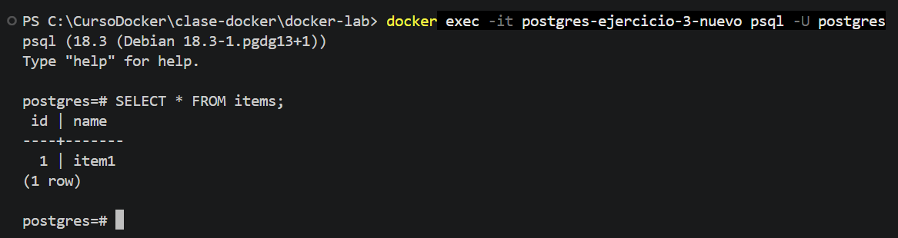

